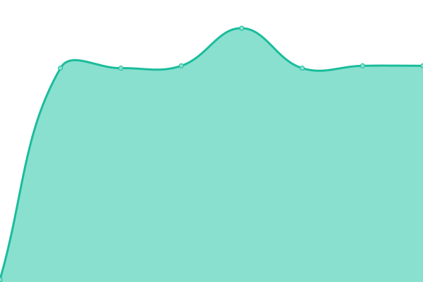

# [📈 Live Status](https://mentordosnerds.github.io/upptime): <!--live status--> **🟧 Partial outage**

This repository contains the open-source uptime monitor and status page for [Mentor dos Nerds](https://mentordosnerds.com), powered by [Upptime](https://github.com/upptime/upptime).

With [Upptime](https://upptime.js.org), you can get your own unlimited and free uptime monitor and status page, powered entirely by a GitHub repository. We use [Issues](https://github.com/mentordosnerds/upptime/issues) as incident reports, [Actions](https://github.com/mentordosnerds/upptime/actions) as uptime monitors, and [Pages](https://mentordosnerds.github.io/upptime) for the status page.

<!--start: status pages-->
<!-- This summary is generated by Upptime (https://github.com/upptime/upptime) -->
<!-- Do not edit this manually, your changes will be overwritten -->
<!-- prettier-ignore -->
| URL | Status | History | Response Time | Uptime |
| --- | ------ | ------- | ------------- | ------ |
|  [Chatwoot](messages.mentordosnerds.com.br) | 🟩 Up | [chatwoot.yml](https://github.com/mentordosnerds/upptime/commits/HEAD/history/chatwoot.yml) | 

 1092ms
     
 | 

<a href="https://mentordosnerds.github.io/upptime/history/chatwoot">100.00%</a>
    

|  [Wallos](subscriptions.mentordosnerds.com.br) | 🟩 Up | [wallos.yml](https://github.com/mentordosnerds/upptime/commits/HEAD/history/wallos.yml) | 

 1221ms
     
 | 

<a href="https://mentordosnerds.github.io/upptime/history/wallos">100.00%</a>
    

|  [i-9.ai](i-9.ai) | 🟩 Up | [i-9-ai.yml](https://github.com/mentordosnerds/upptime/commits/HEAD/history/i-9-ai.yml) | 

 828ms
     
 | 

<a href="https://mentordosnerds.github.io/upptime/history/i-9-ai">100.00%</a>
    

|  [transformandovidas.online](transformandovidas.online) | 🟩 Up | [transformandovidas-online.yml](https://github.com/mentordosnerds/upptime/commits/HEAD/history/transformandovidas-online.yml) | 

 809ms
     
 | 

<a href="https://mentordosnerds.github.io/upptime/history/transformandovidas-online">100.00%</a>
    

|  [contacto.transformandovidas.online](contacto.transformandovidas.online) | 🟩 Up | [contacto-transformandovidas-online.yml](https://github.com/mentordosnerds/upptime/commits/HEAD/history/contacto-transformandovidas-online.yml) | 

 832ms
     
 | 

<a href="https://mentordosnerds.github.io/upptime/history/contacto-transformandovidas-online">100.00%</a>
    

|  [Evolution API](whatsapp.mentordosnerds.com.br) | 🟥 Down | [evolution-api.yml](https://github.com/mentordosnerds/upptime/commits/HEAD/history/evolution-api.yml) | 

 263ms
     
 | 

<a href="https://mentordosnerds.github.io/upptime/history/evolution-api">0.24%</a>
    

|  [LiteLLM](openapi.mentordosnerds.com.br) | 🟥 Down | [lite-llm.yml](https://github.com/mentordosnerds/upptime/commits/HEAD/history/lite-llm.yml) | 

 209ms
     
 | 

<a href="https://mentordosnerds.github.io/upptime/history/lite-llm">100.00%</a>
    

|  [Traefik HTTP](mentordosnerds.com.br) | 🟩 Up | [traefik-http.yml](https://github.com/mentordosnerds/upptime/commits/HEAD/history/traefik-http.yml) | 

 131ms
     
 | 

<a href="https://mentordosnerds.github.io/upptime/history/traefik-http">100.00%</a>
    

|  [Traefik HTTPS](mentordosnerds.com.br) | 🟩 Up | [traefik-https.yml](https://github.com/mentordosnerds/upptime/commits/HEAD/history/traefik-https.yml) | 

 131ms
     
 | 

<a href="https://mentordosnerds.github.io/upptime/history/traefik-https">100.00%</a>
    

<!--end: status pages-->

[**Visit our status website →**](https://mentordosnerds.github.io/upptime)

## 📄 License

- Powered by: [Upptime](https://github.com/upptime/upptime)
- Code: [MIT](./LICENSE) © [Anand Chowdhary](https://anandchowdhary.com), supported by [Pabio](https://pabio.com)
- Data in the `./history` directory: [Open Database License](https://opendatacommons.org/licenses/odbl/1-0/)
